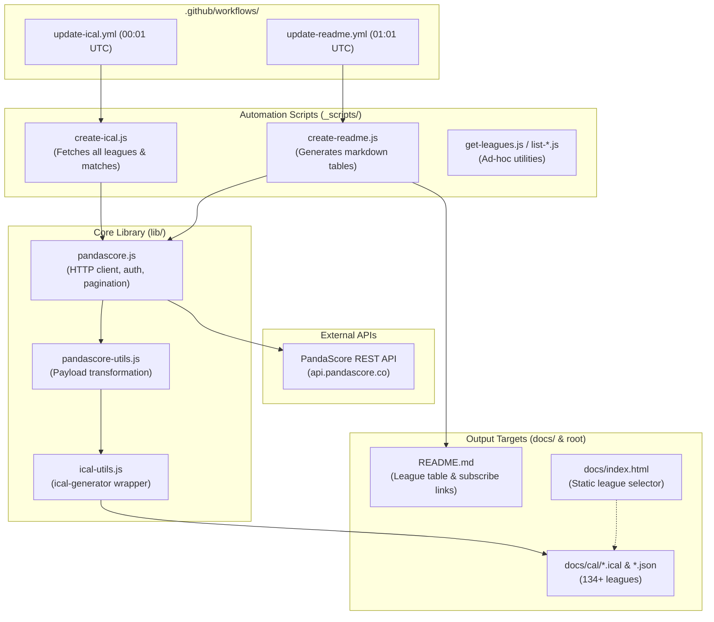

# Codebase Assessment & Modernization Roadmap: `lol-events`

## 1. Executive Summary & Repository Overview

`lol-events` is an automated service that fetches professional League of Legends esports schedules from the [PandaScore REST API](https://pandascore.co/), generates iCalendar (`.ical`) calendar subscription feeds and JSON files for each league, updates a markdown catalog in [README.md](README.md), and publishes a static web directory hosted via GitHub Pages ([docs/](docs/)).

The repository functions reliably in production via daily GitHub Actions cron jobs, but was originally built on a 2020 technology stack (Node 10 era, Parcel v1, Tailwind v1, Moment.js, CommonJS) with unthrottled API concurrency, missing test coverage, and monolithic scripts that are difficult for autonomous agents to inspect, test, or modify safely.

---

## 2. Current Architecture & How It Works



### 2.1 The Data Pipeline

1. **API Ingestion** ([lib/pandascore.js](lib/pandascore.js)):
    - Authenticates using `Bearer process.env.ACCESSTOKEN`.
    - `getAllPages(getLeagues)` iteratively fetches 100 leagues per page until `< 100` items return.
    - For each league, fetches up to 20 past matches (`/leagues/:id/matches/past`), running matches (`/running`), and upcoming matches (`/upcoming`).
2. **Data Normalization** ([lib/pandascore-utils.js](lib/pandascore-utils.js)):
    - Maps raw PandaScore match objects to simplified records: `id`, `name`, `beginAt`, `numberOfGames`, `teams`.
3. **Calendar Synthesis** ([lib/ical-utils.js](lib/ical-utils.js)):
    - Wraps `ical-generator` to create VEVENT objects.
    - Calculates duration by adding `numberOfGames` hours to `beginAt`.
    - Embeds sequence number (defaults to `1`).
4. **State Persistence & Sequence Tracking** ([_scripts/create-ical.js](_scripts/create-ical.js)):
    - Reads existing `./docs/cal/${league.slug}.json`.
    - Compares event `uid` and increments `sequence` if `summary` changed (RFC 5545 change tracking).
    - Writes updated `./docs/cal/${slug}.ical` and `./docs/cal/${slug}.json`.
5. **Documentation & GitHub Pages Publishing**:
    - [_scripts/create-readme.js](_scripts/create-readme.js) renders the markdown table into `README.md`.
    - GitHub Pages serves the `docs/` folder directly.
    - [web/](web/) is a standalone subproject (Parcel 1, PostCSS, Tailwind 1) that once built into `docs/index.html` (last built May 2020).

---

## 3. Findings & Technical Debt

### 3.1 Network & Concurrency Risks

- **Uncontrolled Burst Requests**: In `_scripts/create-ical.js`, `await Promise.all(leagues.map(generateIcalCalendar))` fires 3 concurrent requests per league for over 100 leagues (300+ simultaneous requests) with zero throttling or concurrency limits. This risks IP bans or HTTP 429 rate limit errors from PandaScore.
- **Fragile Error Handling**: In `lib/pandascore.js`, `if (!response.ok) throw json.error;`. If PandaScore returns HTML (e.g. Cloudflare 502/504 gateway error), `response.json()` throws a syntax error or `json.error` is undefined, resulting in unhandled `throw undefined`.
- **No Retry Mechanism**: No exponential backoff on transient network failures or HTTP 429.

### 3.2 Logic & Specification Bugs

- **Sequence Number Comparison Mismatch**:
  In `updateCalendarEvents`:
    ```javascript
    const prevEvent = jsonData.events.find(
        (e) => e.uid === event.uid() && e.summary !== event.summary(),
    );
    ```
    In newer `ical-generator` versions, `event.uid()` returns `id@domain` while `e.uid` in JSON may be a raw numeric ID. More importantly, **rescheduled match times** (changes to `start` or `end`) do not trigger a sequence bump because only `summary` is compared. Subscribers' calendars (Google Calendar / Outlook) will ignore rescheduled match times without an incremented sequence number.
- **Duration / Time Estimation**:
  `moment(date).add(match.numberOfGames, "hour")` breaks if `numberOfGames` is missing or `0`, producing `Invalid Date`.

### 3.3 CI/CD & GitHub Actions

- **Node 10.x Deprecation**: Both workflows specify `node-version: "10.x"` (Node 10 reached EOL in 2021). GitHub Actions runners are phasing out support for legacy Node runtimes.
- **Outdated Actions**: Uses `actions/checkout@v2` and `actions/setup-node@v1` (current is `v4`), and third-party `ad-m/github-push-action@master` instead of native GitHub permissions (`permissions: contents: write`).
- **Duplicate Cron Triggers**: Two separate workflows run daily at 00:01 and 01:01 UTC, querying PandaScore twice and causing two separate commits every day.
- **No Manual Trigger**: Missing `workflow_dispatch`, preventing manual testing or on-demand regeneration.
- **Unconditional Git Commit**: If no calendars change, `git commit -a` can fail with empty changes unless guarded by `git diff --staged --quiet`.

### 3.4 Web Frontend Disconnect

- `web/index.html` has 1016 lines with a hardcoded snapshot of leagues from May 2020.
- `web/package.json` relies on `parcel-bundler@1.12.4`, which fails to install or run on modern Node due to OpenSSL 3.0 crypto changes.
- The website is completely decoupled from the data generator: adding a new league to PandaScore updates `README.md` and `docs/cal/`, but never appears on the web selector unless someone manually runs `get-leagues.js` and rebuilds the bundle.

---

## 4. Modernization Strategy

### 4.1 Architecture & Runtime

1. **Target Modern Node.js (Node 22 LTS / 24)**:
    - Adopt **ECMAScript Modules (ESM)** (`"type": "module"` in `package.json`).
    - Use Node's built-in global `fetch` (no `node-fetch`).
    - Use Node's built-in `fs/promises` and `fs.rmSync` (no `rimraf`).
    - Use Node's native `--env-file=.env` (Node 20.6+) or modern `dotenv` v16.
    - Use standard `URLSearchParams` instead of `qs` for query strings.
2. **Replace Moment.js**:
    - Moment.js is in legacy maintenance mode.
    - Replace with native JavaScript `Intl` + `Date` or `date-fns` (lightweight, tree-shakeable, immutable).
3. **Resilient HTTP Client & Concurrency**:
    - Implement concurrency throttling (e.g. `p-limit` or batching with `limit = 5`) for league processing.
    - Add exponential backoff retry on HTTP 429 / 5xx errors with `Retry-After` header support.
4. **RFC 5545 Calendar Polish**:
    - Compare `start`, `end`, and `summary` when determining whether to bump event `sequence`.
    - Add fallback duration (default: 3 hours for Bo3, 1 hour for Bo1, or 2 hours default) if `numberOfGames` is missing.
    - Add match description with team matchups and PandaScore/LoLEsports links if available.
5. **Consolidate CI/CD**:
    - Merge `update-ical.yml` and `update-readme.yml` into a single unified `update-data.yml`.
    - Upgrade to `actions/checkout@v4` and `actions/setup-node@v4` (Node 22).
    - Use native `permissions: contents: write` and standard `git push`.
    - Add `workflow_dispatch` trigger.
6. **Frontend Modernization**:
    - Replace abandoned Parcel v1 with a **zero-build dynamic page**:
    - Have `create-ical.js` or `create-readme.js` emit a single `docs/leagues.json` manifest.
    - The webpage dynamically fetches `leagues.json` and provides an instant client-side search box to filter leagues by name and copy the iCal URL. No complex build step required.

---

## 5. Dependency Update Matrix

| Package                    | Current Version | Target Version              | Action & Migration Notes                                                                                                                                               |
| :------------------------- | :-------------- | :-------------------------- | :--------------------------------------------------------------------------------------------------------------------------------------------------------------------- |
| **`ical-generator`**       | `^1.9.2`        | `^11.1.2`                   | **Major upgrade**. API changed from method chaining (`ical(...)`) to modern class/function syntax `import { ICalCalendar } from 'ical-generator'`. Types are built-in. |
| **`moment`**               | `^2.29.4`       | _Removed_ / `date-fns ^4.x` | Moment is deprecated. Replace with native `Date` / `Intl` or `date-fns`.                                                                                               |
| **`node-fetch`**           | `^2.6.7`        | _Removed_                   | Use Node 20+ native global `fetch`.                                                                                                                                    |
| **`qs`**                   | `^6.10.3`       | _Removed_ / `^6.14`         | Native `URLSearchParams` handles PandaScore's flat query params (`page`, `per_page`, `filter[...]`).                                                                   |
| **`dotenv`**               | `^8.2.0`        | `^16.4.7` / native          | Upgrade to v16 or use `node --env-file=.env`.                                                                                                                          |
| **`rimraf`**               | `^3.0.2`        | _Removed_                   | Use native `fs.rmSync(path, { recursive: true, force: true })`.                                                                                                        |
| **`p-limit`**              | _None_          | `^6.2.0`                    | Add to control request concurrency to PandaScore.                                                                                                                      |
| **`vitest`**               | _None_          | `^3.0.0` (dev)              | Fast unit and integration test runner.                                                                                                                                 |
| **`typescript`**           | _None_          | `^5.7.0` (dev)              | Add type declarations (`@types/node`) or TypeScript migration.                                                                                                         |
| **`parcel-bundler`** (web) | `^1.12.4`       | _Removed_                   | Parcel 1 is broken on modern Node. Replace with Vite or lightweight static runtime.                                                                                    |
| **`tailwindcss`** (web)    | `^1.4.6`        | `^3.4` / CDN                | Upgrade to Tailwind v3/v4 or lightweight modern CSS.                                                                                                                   |

---

## 6. Phased Implementation Plan

- [x] **Phase 1: Foundations & Agent Enablement**
    - Add [AGENTS.md](AGENTS.md) operational manual.
    - Set up `vitest` with offline fixtures for PandaScore and iCal verification.
    - Add ESLint & Prettier configs and npm verification scripts (`npm test`, `npm run lint`, `npm run format:check`).
    - Store assessment and roadmap in [ROADMAP.md](ROADMAP.md).
- [x] **Phase 2: Dependency & Runtime Modernization**
    - Target Node 24 (`"engines": { "node": ">=24.0.0" }` and GitHub Actions).
    - Full TypeScript migration across all `lib/`, `_scripts/`, and `test/` modules with comprehensive type definitions in `lib/types.ts`.
    - Migrate to ESM (`"type": "module"`).
    - Remove `node-fetch`, `rimraf`, `moment`.
    - Upgrade `ical-generator` to v11+, adapt calendar creation functions.
    - Verify all tests pass against offline fixtures.
- [ ] **Phase 3: Resilient Architecture & CLI**
    - Implement concurrency throttling (`p-limit`) to prevent PandaScore 429 errors.
    - Fix sequence number detection for rescheduled matches and date shifts.
    - Add CLI arguments (`--league`, `--dry-run`, `--limit`, `--json`).
- [ ] **Phase 4: CI/CD & Dynamic Frontend**
    - Consolidate GitHub Actions to a single modern workflow with Node 22 and `workflow_dispatch`.
    - Generate `docs/leagues.json` manifest.
    - Replace broken Parcel web bundle with a clean, dynamic zero-build HTML/JS interface with search & filter.
